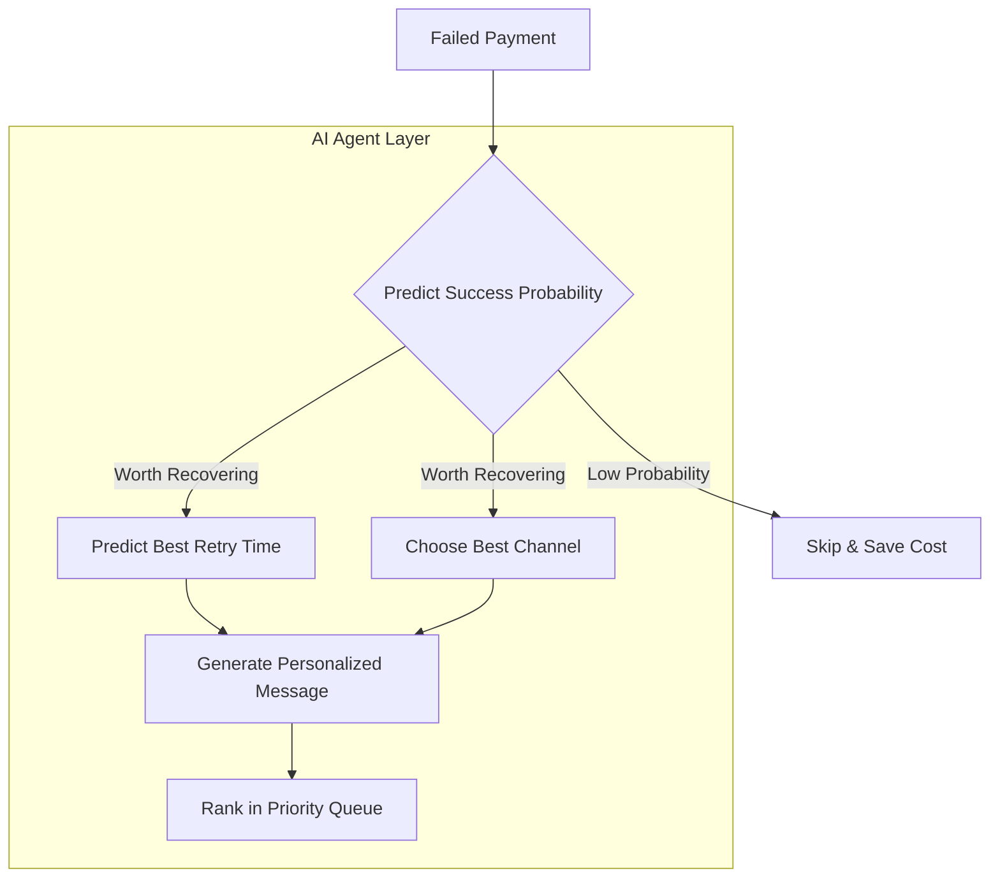

<div align="center">

# 💳 Smart Payment Recovery Agent

### 🚀 Autonomous AI Agent for Fintech Revenue Recovery


**Built for the Razorpay AI Buildathon — Track: AI Revenue Recovery**

</div>

---

## 🎯 The Problem

Every year, fintech businesses lose **crores in revenue** to failed payments — insufficient balance, OTP errors, bank downtime, expired cards. Most companies either don't follow up at all, or blast the same generic message to everyone, ignoring *who's actually worth recovering* and *when to contact them*.

## 💡 The Solution

An **automation AI agent** that, for every failed transaction, thinks like a smart recovery analyst. It predicts success probabilities, decides the best time to retry, drafts a personalized message based on real company policies, and tracks the ROI.



---

## ⭐ Key Features

| Feature | Description |
|---|---|
| 🧠 **Agent Reasoning Trace** | Every AI prediction is fully explained. You can see exactly *why* the agent decided to attempt a recovery or skip it. |
| 🎯 **Recovery Priority Queue** | Ranks pending failures by `probability × amount`, telling the business exactly where to focus efforts for maximum ROI. |
| 💰 **ROI Simulator** | Interactive sliders project monthly and annual revenue impact at scale — helping non-technical stakeholders understand the business value. |
| 🤖 **AI Chatbot Assistant** | A built-in, context-aware chatbot (with strict guardrails) that can answer any questions you have about the data, the architecture, and the models. |
| 📚 **RAG-Grounded Messaging** | The LLM never invents policies or offers — every claim in the generated recovery message is grounded in actual retrieved policy documents. |

---

## 🏗️ Architecture & Tech Stack

<div align="center">

| Layer | Technology |
|---|---|
| **Language** | Python 3.13 |
| **ML Models** | scikit-learn (GradientBoostingClassifier, RandomForestRegressor) |
| **GenAI LLM** | Groq API — `openai/gpt-oss-120b` |
| **RAG System** | Custom policy-doc retrieval layer |
| **Backend API**| FastAPI + Uvicorn |
| **Frontend UI**| React + Vite + Recharts + Lucide Icons |
| **Database** | SQLite + SQLAlchemy |

</div>

---

## 🚀 Quick Start

Follow these steps to run the complete AI Agent and UI locally:

```bash
# 1. Clone & enter project
git clone https://github.com/anujd1432/smart-payment-recovery.git
cd smart-payment-recovery

# 2. Set up virtual environment
python -m venv venv
venv\Scripts\activate          # Windows
# source venv/bin/activate     # Mac/Linux

# 3. Install dependencies
pip install -r requirements.txt

# 4. Add your Groq API key
echo GROQ_API_KEY=your_key_here > .env

# 5. Generate data → DB → train models
python data/generate_data.py
python db/database.py
python ml/train_models.py

# 6. Run the backend (Terminal 1)
uvicorn backend.main:app --reload --port 8000

# 7. Run the frontend (Terminal 2)
cd frontend
npm run dev
```

🔗 **API Docs (Swagger)**: `http://localhost:8000/docs`
🔗 **Dashboard UI**: `http://localhost:8501`

---

## 📡 API Endpoints

The backend exposes several powerful endpoints to interact with the Agent:

| Endpoint | Method | Description |
|---|---|---|
| `/trigger-recovery-agent` | `POST` | 🚀 **Main Pipeline**: Runs the full agent decision loop end-to-end. |
| `/chat` | `POST` | 🤖 **AI Assistant**: Conversational endpoint to ask questions about the project. |
| `/priority-queue` | `GET` | 🎯 **Queue**: Retrieves top-N transactions ranked by expected recovery value. |
| `/analytics` | `GET` | 📊 **Stats**: Aggregates total metrics for the dashboard charts. |
| `/predict-failure-success` | `POST` | 🧠 **ML Only**: Predicts retry success probability + best hour. |
| `/generate-recovery-message` | `POST` | 💬 **GenAI Only**: Drafts a message using RAG without running ML. |

---

## 📊 ML Model Performance

The system trains local scikit-learn models on the generated synthetic data:

**Retry Success Model (GradientBoostingClassifier)**
- **Accuracy**: ~67.0%
- **ROC-AUC**: ~0.678
- **Top Decision Drivers**: `past_success_rate` (43%), `failure_reason` (28%), `amount` (17%)

---

## 🧗 Build Challenges Solved

- ⚖️ **Spam vs. Value**: Implemented a probability threshold so low-value transactions are silently skipped instead of triggering unnecessary outreach (saving API and SMS costs).
- 🔒 **GenAI Hallucinations**: Implemented strict RAG grounding so the LLM never invents offers or policies that don't exist in the database.
- 🛡️ **Chatbot Guardrails**: The integrated AI assistant has system-level restrictions that prevent it from answering off-topic or general knowledge questions.
- 🐍 **Zero-Friction Setup**: Defaulted to SQLite instead of Postgres so anyone can run the full stack locally in under 3 minutes.

---

## 🔮 Roadmap

- [ ] Real vector search (ChromaDB embeddings) replacing keyword-based RAG retrieval.
- [ ] WhatsApp/SMS/Email delivery integration (Twilio / WhatsApp Business API).
- [ ] LangGraph multi-step retry loop with human-in-the-loop approval for high-value transactions.
- [ ] Docker + cloud deployment for a live demo link.

---
